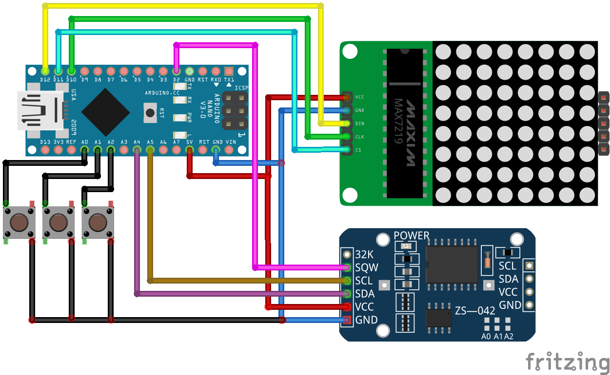

# binary-clock
Бинарные часы на ардуино

### Комплектующие
  - Ардуино
  - Модуль RTC ds3231 или аналогичный
  - Светодиодная матрица на контроллере max7219 или аналогичном
  - Проводки и кнопочки
  
### Библиотеки
  - *Wire* - библиотека для работы с I2C-интерфейсом (по которому работает RTC-модуль). По умолчанию в поставке Arduino IDE
  - *LEDControlMS* - библиотека для работы со светодиодными матрицами и им подобному
  
  
### Подключение

